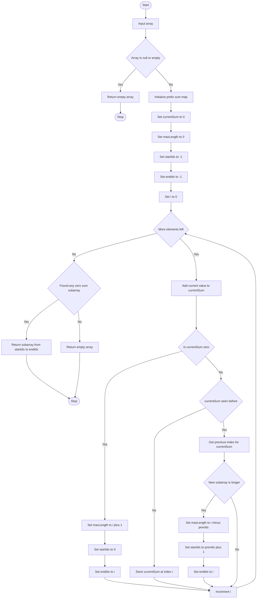

# ZeroSumSubarray Flowchart

```mermaid
flowchart TD
    A([Start]) --> B[Input array]
    B --> C{Array is null or empty}

    C -->|Yes| D[Return empty array]
    D --> E([Stop])

    C -->|No| F[Initialize prefix sum map]
    F --> G[Set currentSum to 0]
    G --> H[Set maxLength to 0]
    H --> I[Set startIdx to -1]
    I --> J[Set endIdx to -1]
    J --> K[Set i to 0]

    K --> L{More elements left}
    L -->|No| W{Found any zero sum subarray}

    L -->|Yes| M[Add current value to currentSum]
    M --> N{Is currentSum zero}

    N -->|Yes| O[Set maxLength to i plus 1]
    O --> P[Set startIdx to 0]
    P --> Q[Set endIdx to i]
    Q --> V[Increment i]

    N -->|No| R{currentSum seen before}
    R -->|No| S[Store currentSum at index i]
    S --> V

    R -->|Yes| T[Get previous index for currentSum]
    T --> U{New subarray is longer}
    U -->|Yes| U1[Set maxLength to i minus prevIdx]
    U1 --> U2[Set startIdx to prevIdx plus 1]
    U2 --> U3[Set endIdx to i]
    U3 --> V
    U -->|No| V

    V --> L

    W -->|Yes| X[Return subarray from startIdx to endIdx]
    X --> Y([Stop])
    W -->|No| Z[Return empty array]
    Z --> Y
```

